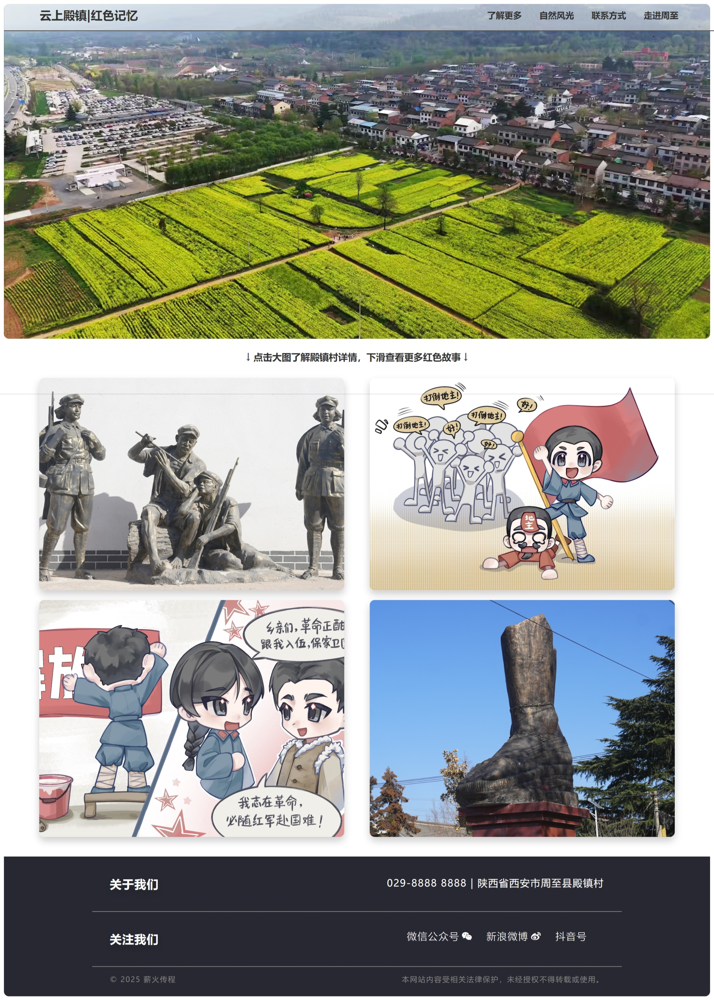

# 旅行（Travel）

Travel 是一个简洁、美观的作品集主题，适用于 Hexo 静态网站生成器。点击[这里](https://seusoldiers.github.io/social_web/)查看该主题的演示。



## 主题安装

### 从 Github 安装

在你的 Hexo 站点的 `/themes` 目录下运行以下命令：

```sh
git clone https://github.com/harkerhand/hexo-theme-travel
```

### 从 npm 安装

在你的 Hexo 站点的根目录下运行一下命令：

```sh
npm install hexo-theme-travel --save
```

### 配置主题

然后更新博客的主 `_config.yml` 文件，将主题设置为 `hexo-theme-travel`：

```yaml
# 扩展
## 插件: http://hexo.io/plugins/
## 主题: http://hexo.io/themes/
theme: hexo-theme-travel
```

## 主题配置

### 默认设置

```yaml
# 默认文章封面图
default_cover_image: images/default_back.jpg
# 默认文章标题
default_post_title: 'Default Title'
# 首页视频
main_back_video: 'videos/main.mp4'
# 首页视频下方文字
info_text: 'Text'
# 网站根目录（兼容性）
url_root: '/'
```

### 头部菜单

```yaml
# 示例
menu:
  '了解更多': /about
  '自然风光': /nature
  '联系方式': /contact
  '走进周至': https://www.zhouzhi.gov.cn/rwzz/
```

注意：如果使用类似前三种的样式，需要在 `/source` 文件夹下新建同名文件夹及其 `index.md`

### 页脚信息

#### 联系方式

```yaml
foot_about:
  phone: '8888 8888'
  address: '地球'
```

#### 社交媒体

```yaml
media:
  - icon: iconfont icon-wechat-fill
    link: '#'
    tip: '微信公众号'
  - icon: iconfont icon-weibo-fill
    link: '#'
    tip: '新浪微博'
  - icon: iconfont icon-douyin
    link: '#'
    tip: '抖音号'
```

注意：图标用法参考下文 Iconfont

### Iconfont 字体图标

```yaml
iconfont:
- //at.alicdn.com/t/c/font_1736178_k526ubmyhba.css
- //at.alicdn.com/t/c/font_4823232_6grnmuy6d4c.css
```


## 文章配置

对于每篇文章，需要在 [Front Matter](https://hexo.io/docs/front-matter.html) 中指定额外的信息。

### 文章标题

使用 `title` 指定文章的标题。

```yaml
title: 我的精彩作品
```

### 文章封面图

本主题的每篇文章都需要一个封面图。如果没有提供封面图，将使用默认封面图。可以通过以下方式指定自己的封面图。

```yaml
cover_image: /images/cover114.jpg
```

## 主题作者

此主题由 [何山](http://www.harkerhand.online/) 设计并创建。

## 反馈与问题

如果你有任何问题、功能请求或需要修复的 Bug，请[点击这里](https://github.com/harkerhand/hexo-theme-travel/issues/new)提交问题。

